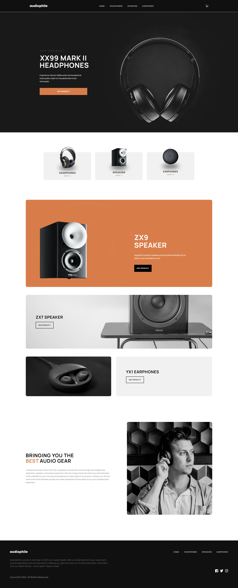

# Audiophile e-commerce website solution

This is a solution to the [Audiophile e-commerce website challenge on Frontend Mentor](https://www.frontendmentor.io/challenges/audiophile-ecommerce-website-C8cuSd_wx). Frontend Mentor challenges help you improve your coding skills by building realistic projects.

## Table of contents

- [Overview](#overview)
  - [The challenge](#the-challenge)
  - [Screenshot](#screenshot)
  - [Links](#links)
  - [Built with](#built-with)
  - [What I learned](#what-i-learned)
  - [Author](#author)

**Note: Delete this note and update the table of contents based on what sections you keep.**

## Overview

### The challenge

Users should be able to:

- View the optimal layout for the app depending on their device's screen size
- See hover states for all interactive elements on the page
- Add/Remove products from the cart
- Edit product quantities in the cart
- Fill in all fields in the checkout
- Receive form validations if fields are missed or incorrect during checkout
- See correct checkout totals depending on the products in the cart
  - Shipping always adds $50 to the order
  - VAT is calculated as 20% of the product total, excluding shipping
- See an order confirmation modal after checking out with an order summary

### Screenshot

### Links

- Solution URL: [https://www.frontendmentor.io/solutions/audiophile-ecommerce-website-7XFXtSBIp-](https://www.frontendmentor.io/solutions/audiophile-ecommerce-website-7XFXtSBIp-)
- Live Site URL: [https://ecommerce-website-blush-psi.vercel.app/](https://ecommerce-website-blush-psi.vercel.app/)

### Built with

- MERN Stack
- Full Stack application
- React
- TypeScript
- Express.js
- MongoDB
- Tailwind CSS

### What I learned

## Author

- Github - [Jinyoung Choi](https://github.com/jinyoung5497)
- Frontend Mentor - [@jinyoung5497](https://www.frontendmentor.io/profile/jinyoung5497)
